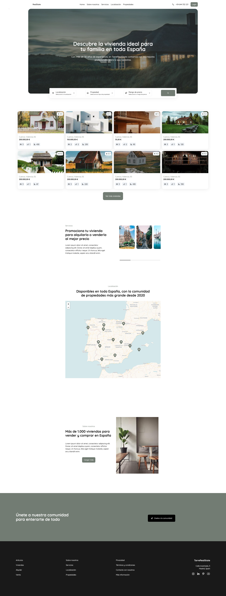
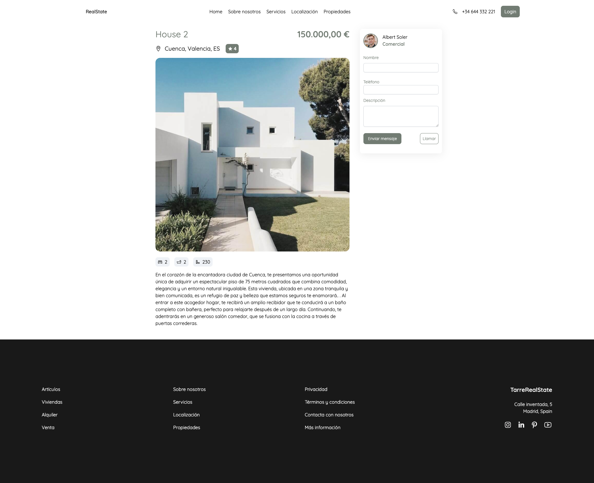

## React JS, NextJS, Tailwind CSS, Framer Motion, Leaflet JS, Swiper JS.

```bash
# Step 1 - Install dependences
yarn
# Step 2 - See the result in your browser on localhost:3000
yarn dev
```






## Deploy 

```bash
yarn build
```
